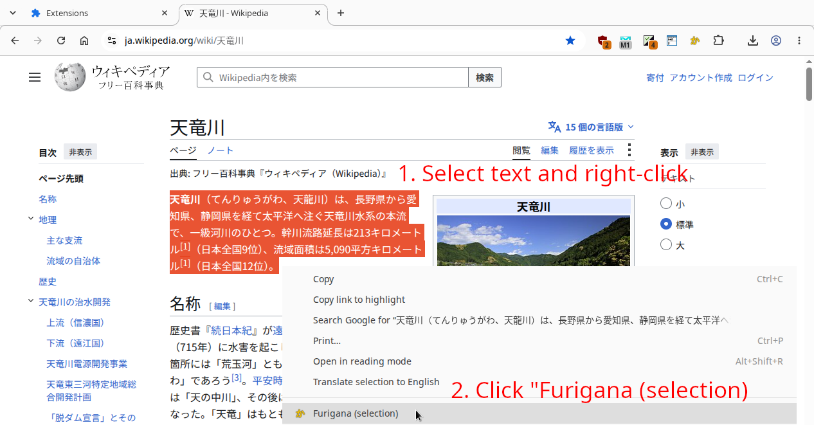
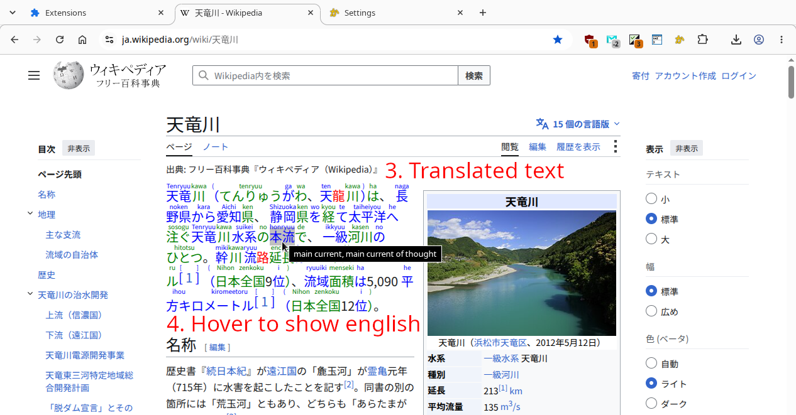

# What is it?

Furigana is chrome extension that convert kanji (japanese text) to 
furigana, that is a japanese text with small hints above each word 
how to pronounce it. For known words it also displays english meaning 
of the word. It uses my own dictionary-based kanji tokenizer. Data
are from EDICT dictionary plus my own data.

Unlike similar extensions (e.g. IPA Furigana), this one converts all
kanji, not just the "hard ones". It also converts hiragana and katakana.

For example:

    Original: 時速５０１キロ体験！リニアモーターカー車内映像 ！

    Furigana: jisoku 501 kiro taiken! rinia mootaakaa shanai eizou!

    IPA Furigana: jisoku ５０１キロ taiken ！リニアモーターカーshanai eizou!

# How to use it?

Select text you want to translate. Right-click to display context menu
and choose "Furigana" with yellow icon. This will translate selected
text.

Because sometimes it hard to select entire sentence, especially around the
edges, when you select the middle of sentence, entire block of text will be
translated.

You can also translate text in popup window (click on yellow icon in upper
right corner, type text and press button "Furigana").

You can add new words to dictionary and publish it for others.

# Support

You can support development on [Patreon](https://www.patreon.com/DusanHalicky) or you can hire me via [Upwork](https://www.upwork.com/freelancers/~013b4c3d6e772fdb01)

